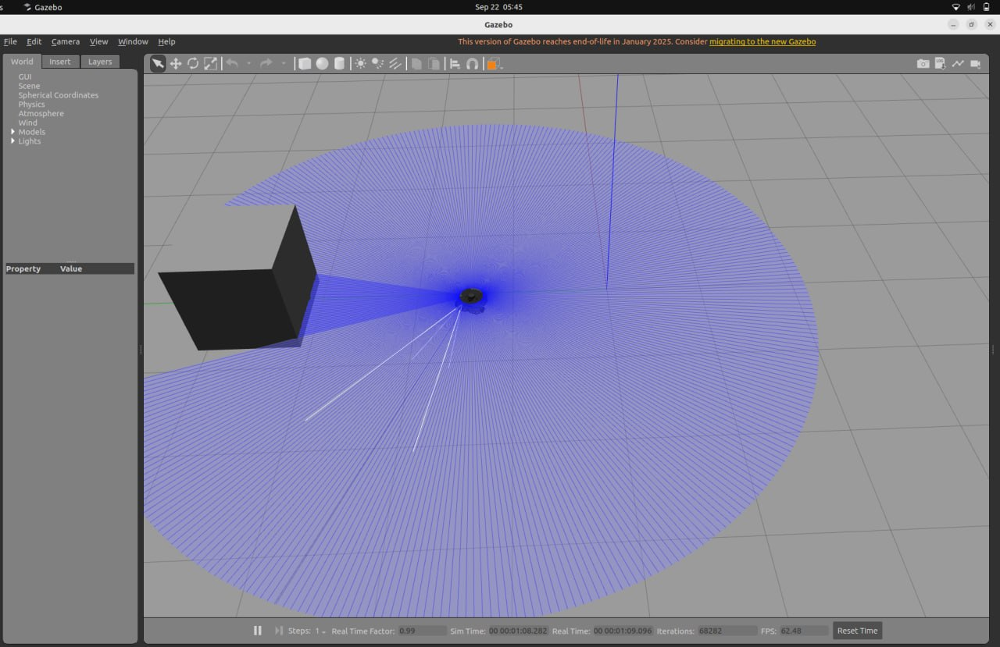
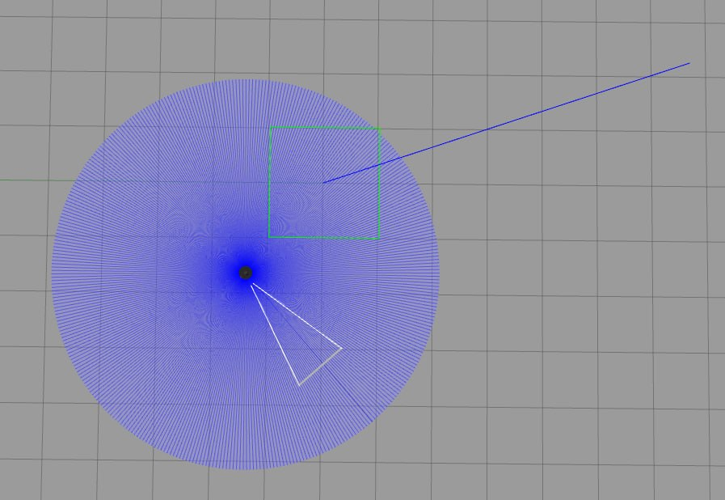

# TurtleBot3 Planner-Based Task Execution

## Project Overview

This project connects a PDDLStream task planner to a ROS 2 execution system for a simulated TurtleBot3 Waffle in Gazebo.

The planner decides the sequence of actions. The ROS 2 side receives the generated plan and executes the actions one by one. Base movement is executed on the TurtleBot3 using the trajectory generated by PDDLStream, while pick and place actions are still simulated because no robot arm is used in this exercise.

The main execution flow is:

```text
PDDLStream plan
      ↓
JSON plan file
      ↓
Task Controller
      ↓
Robot Controller
      ↓
TurtleBot3 in Gazebo
```

For `move_base`, the Robot Controller follows the trajectory using odometry feedback and publishes velocity commands on `/cmd_vel`.

---

## System Architecture

```mermaid
flowchart TD
    A[PDDLStream] --> B[export_plan.py]
    B --> C[Plan JSON]
    C --> D[Task Controller]

    D -->|/move_command| E[Robot Controller]
    D -->|/task/action| E
    E -->|/action_done| D

    E -->|/cmd_vel| F[TurtleBot3 / Gazebo]
    F -->|/odom| E

    G[Task Monitor] -->|/get_robot_status| E
    H[/reset_robot_controller] --> E
```

The planner does not publish directly to `/cmd_vel`. Planning and robot control are kept separate: PDDLStream produces the action plan and the Robot Controller is responsible for converting movement actions into velocity commands.

---

## PDDLStream

PDDLStream is used as the high-level task planner. The continuous 2D domain is used for this project.

The planner can generate actions such as:

```text
move_base
pick_and_stow
move_base
unstow_and_place
```

For a `move_base` action, the planner output contains:

- start base configuration
- base trajectory
- destination base configuration

The trajectory contains a sequence of base configurations `(x, y, theta)` that are used as waypoints by the ROS 2 execution system.

The PDDLStream algorithm itself is not modified. `planner_reference/export_plan.py` only converts the generated plan into JSON so that it can be read by the ROS 2 package.

The included sample plan was generated for:

```text
problem: get_pick_and_place_problem
algorithm: adaptive
merged_actions: true
number of actions: 4
```

Its action sequence is:

```text
1. MOVE_BASE
2. PICK_cube1
3. MOVE_BASE
4. PLACE_cube1
```

---

## ROS 2 Packages

The workspace contains two ROS 2 packages.

### `robot_task_interfaces`

This package contains the custom message and service definitions used by the system.

#### `Waypoint.msg`

```text
float64 x
float64 y
float64 theta
```

Each waypoint represents one base pose from the planner trajectory.

#### `MoveCommand.msg`

```text
string action_label
Waypoint[] waypoints
```

This message transfers a planned base trajectory from the Task Controller to the Robot Controller.

#### `GetRobotStatus.srv`

The service returns:

```text
string status
string current_action
float64 elapsed_time
```

---

### `robot_task_system`

This package contains the execution nodes, plan parser, launch files, and sample plan.

Main files:

```text
robot_task_system/
├── config/
│   └── plan_pick_place.json
├── launch/
│   ├── planner_execution.launch.py
│   └── robot_task_system.launch.py
├── robot_task_system/
│   ├── plan_parser.py
│   ├── task_controller.py
│   ├── robot_controller.py
│   └── task_monitor.py
└── test/
```

---

## Nodes

### Task Controller

Node name:

```text
/task_controller
```

The Task Controller is responsible for:

- loading the JSON plan
- parsing the planner actions
- keeping the actions in an execution queue
- sending the current action to the Robot Controller
- waiting for the action result
- sending the next action only after the previous one succeeds
- stopping the task queue when an action fails

Movement actions are published as `MoveCommand` messages. Pick and place actions are sent as normal string actions.

The plan coordinates can also be anchored to the odometry origin. This makes the first planner pose correspond to the TurtleBot3 starting pose in Gazebo.

---

### Robot Controller

Node name:

```text
/robot_controller
```

The Robot Controller executes the actions received from the Task Controller.

For movement actions it:

1. receives the trajectory
2. reads the current robot pose from `/odom`
3. selects the current waypoint
4. calculates the distance and heading error
5. publishes velocity commands on `/cmd_vel`
6. moves to the next waypoint after reaching the current one
7. rotates to the final goal orientation
8. publishes the action result

For the current exercise, pick and place actions are simulated with short timers:

```text
PICK  -> 3 seconds
PLACE -> 2 seconds
```

The Robot Controller has three main states:

```text
IDLE
EXECUTING
ERROR
```

---

### Task Monitor

Node name:

```text
/task_monitor
```

The Task Monitor calls `/get_robot_status` and prints the current state of the Robot Controller, the current action, and the elapsed execution time when an action is running.

---

## Topics and Services

| Name | Type | Publisher / Server | Subscriber / Client | Purpose |
|---|---|---|---|---|
| `/move_command` | `robot_task_interfaces/msg/MoveCommand` | Task Controller | Robot Controller | Send a base trajectory |
| `/task/action` | `std_msgs/msg/String` | Task Controller | Robot Controller | Send simulated non-movement actions |
| `/action_done` | `std_msgs/msg/Bool` | Robot Controller | Task Controller | Report action success or failure |
| `/cmd_vel` | `geometry_msgs/msg/Twist` | Robot Controller | TurtleBot3 diff drive | Control robot velocity |
| `/odom` | `nav_msgs/msg/Odometry` | TurtleBot3 | Robot Controller | Current robot pose and motion estimate |
| `/get_robot_status` | `robot_task_interfaces/srv/GetRobotStatus` | Robot Controller | Task Monitor | Read controller status |
| `/reset_robot_controller` | `std_srvs/srv/Trigger` | Robot Controller | ROS 2 client | Reset the controller from ERROR to IDLE |

---

## Converting `move_base` to TurtleBot3 Motion

The JSON plan is read by `plan_parser.py`. For every `move_base` action, the parser extracts the base trajectory and final goal.

Example internal representation:

```text
MOVE_BASE
trajectory:
    (x1, y1, theta1)
    (x2, y2, theta2)
    (x3, y3, theta3)
final goal:
    (xg, yg, thetag)
```

The Task Controller converts these configurations to `Waypoint` messages and publishes them on `/move_command`.

The Robot Controller then follows the waypoints using a simple feedback controller.

For each waypoint:

```text
dx = target_x - current_x
dy = target_y - current_y

distance = sqrt(dx^2 + dy^2)
target_yaw = atan2(dy, dx)
angle_error = target_yaw - current_yaw
```

If the heading error is large, the robot turns first. Otherwise, it moves forward while applying a small angular correction.

The current implementation follows the `(x, y)` position of intermediate waypoints. Their `theta` values are not directly tracked. The robot heading during the path is calculated from the direction of the next waypoint. After reaching the last waypoint, the controller rotates the robot to the final `theta` from the planner.

---

## Coordinate Anchoring

The PDDLStream trajectory and Gazebo odometry do not have to start from the same coordinate value.

When `anchor_to_origin` is enabled, the Task Controller uses the first waypoint of the first `move_base` action as the planner origin. All movement waypoints are translated and rotated relative to that starting pose.

This allows the generated path shape to be preserved while the trajectory starts from the TurtleBot3 odometry origin.

---

## Error Handling

The system includes basic error handling for plan loading and robot execution.

### Task Controller

The Task Controller does not start execution when:

- no `plan_file` is provided
- the plan file does not exist
- the plan contains no executable actions

If an action returns `False` on `/action_done`, the task queue is stopped and no next action is dispatched.

### Robot Controller

A movement action fails when:

- the received trajectory is empty
- no odometry message is received during startup
- the `/odom` stream is lost during movement
- the movement takes longer than the allowed movement time
- the robot makes no sufficient position progress for the configured stuck time

Current movement limits in the controller are:

```text
waypoint tolerance:       0.10 m
final angle tolerance:    0.10 rad
maximum movement time:    180 s
odometry timeout:         5 s
initial odometry timeout: 120 s
stuck check time:         20 s
minimum progress:         0.05 m
```

When movement fails, the Robot Controller publishes a zero `Twist`, enters the `ERROR` state, and publishes `False` on `/action_done`.

The controller can be reset using:

```bash
ros2 service call /reset_robot_controller std_srvs/srv/Trigger '{}'
```

---

## TurtleBot3 ROS 2 Interfaces

The TurtleBot3 simulation provides the ROS 2 interfaces needed for movement and feedback.

The movement command topic is:

```text
/cmd_vel
```

Message type:

```text
geometry_msgs/msg/Twist
```

The diff-drive controller subscribes to this topic and changes the linear and angular velocity of the robot.

The Robot Controller uses:

```text
/odom   nav_msgs/msg/Odometry
```

for the current position and orientation.

Other useful TurtleBot3 simulation topics include:

```text
/scan
/imu
/camera/image_raw
/camera/camera_info
/tf
/tf_static
```

During keyboard teleoperation, the teleoperation node publishes movement commands on `/cmd_vel`. In this project, that role is replaced by the Robot Controller during task execution.

---

## Running PDDLStream

The planner repository requires Python and Fast Downward. From the PDDLStream repository:

```bash
python -m venv .venv
source .venv/bin/activate
pip install -r requirements.txt
./downward/build.py
```

The current project uses the continuous 2D domain.

To export a plan using the helper included in this project, run it with the planner repository on `PYTHONPATH`:

```bash
cd /path/to/pddlstream-robocup-at-work

PYTHONPATH=. python /path/to/week22/planner_reference/export_plan.py \
    -p get_pick_and_place_problem \
    --algorithm adaptive \
    -o /path/to/week22/src/robot_task_system/config/plan_pick_place.json
```

`export_plan.py` saves the action name, arguments, trajectory objects, planner cost, and basic plan information in JSON format.

A sample plan is already included in:

```text
src/robot_task_system/config/plan_pick_place.json
```

---

## Building the ROS 2 Workspace

From the workspace root:

```bash
source /opt/ros/humble/setup.bash
source ~/turtlebot3_ws/install/setup.bash

colcon build --symlink-install
source install/setup.bash
```

Set the TurtleBot3 model:

```bash
export TURTLEBOT3_MODEL=waffle
```

---

## Running the Scenario

The main launch file starts the TurtleBot3 Gazebo world, Robot Controller, and Task Controller:

```bash
ros2 launch robot_task_system planner_execution.launch.py
```

The default plan is the included `plan_pick_place.json`.

To run another exported plan:

```bash
ros2 launch robot_task_system planner_execution.launch.py \
    plan_file:=/absolute/path/to/plan.json
```

Gazebo can be disabled when needed:

```bash
ros2 launch robot_task_system planner_execution.launch.py \
    use_gazebo:=false
```

The robot spawn position can also be changed:

```bash
ros2 launch robot_task_system planner_execution.launch.py \
    x_pose:=0.0 \
    y_pose:=0.0
```

To read the controller status in another terminal:

```bash
source install/setup.bash
ros2 run robot_task_system task_monitor
```

---

## Example Execution

For the included pick-and-place plan, the parsed action sequence is:

```text
1) MOVE_BASE (13 waypoints)
2) PICK_cube1
3) MOVE_BASE (18 waypoints)
4) PLACE_cube1
```

A successful execution follows this pattern:

```text
Loaded plan "plan_pick_place.json" (... 4 actions).
Task Controller node has started.
Queue contains 4 actions.

Dispatched MOVE_BASE (... waypoints ...).
Action succeeded: MOVE_BASE
3 actions remaining.

Dispatched action: PICK_cube1
Action succeeded: PICK_cube1
2 actions remaining.

Dispatched MOVE_BASE (... waypoints ...).
Action succeeded: MOVE_BASE
1 actions remaining.

Dispatched action: PLACE_cube1
Action succeeded: PLACE_cube1
0 actions remaining.

All actions completed successfully.
```

A couple of screenshots from the TurtleBot3 simulation is included below:




---

## Main Implementation Problems and Solutions

### Planner coordinates and Gazebo odometry

The planner trajectory can start from a pose that is different from the Gazebo odometry origin. The Task Controller solves this by transforming all movement waypoints relative to the first planner pose.

### Executing planner movement instead of a fixed delay

The previous simulated movement was based only on elapsed time. In this version, `move_base` is converted to a `MoveCommand`, and the Robot Controller follows the actual planner trajectory using `/odom` feedback and `/cmd_vel` commands.

### Waiting for Gazebo odometry

Gazebo may need some time before the first `/odom` message becomes available. The controller waits for initial odometry and prints warning messages before treating the missing odometry as an error.

### Detecting failed movement

The controller checks movement timeout, odometry loss, and robot progress. If the robot is not moving enough for a fixed amount of time, the action fails instead of remaining in the `EXECUTING` state forever.

### Pick and place without a robot arm

The exercise does not use a physical or simulated arm at this stage. Therefore, the planner pick/place actions are kept in the task sequence but their execution is represented by short timed operations in the Robot Controller.
